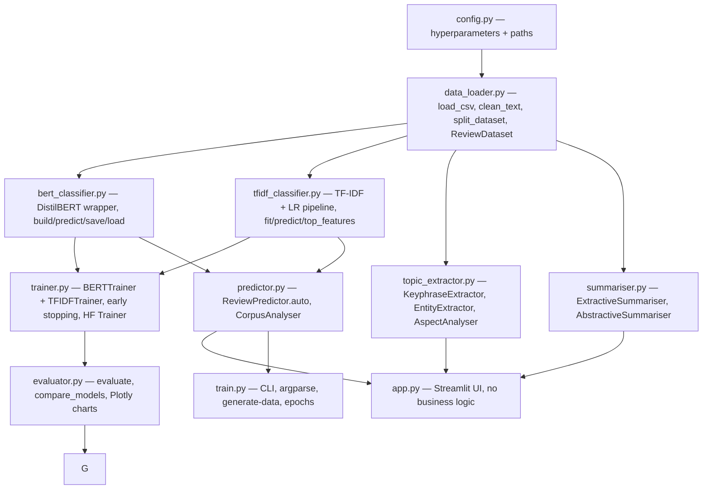

# NLP Review Intelligence

A CPU-only NLP pipeline for classifying review sentiment, extracting topics, and summarising customer feedback. Fine-tuned DistilBERT handles sentiment while a TF-IDF + Logistic Regression baseline provides an interpretable fallback. spaCy components surface entities, aspects, and key phrases, and a simple extractive summariser keeps the stack light.

## Overview

The repository bundles everything needed to train both classifiers, evaluate them, and run inference or a Streamlit dashboard locally. The focus is on practical engineering: reproducible splits, clear configuration, and tools that work without GPU or external APIs.

## Business use case

Customer reviews are a gold mine but hard to read at scale. This pipeline automates the most common review-processing tasks so you can: categorize sentiment, isolate which aspects (quality, price, shipping, service, usability) drive feedback, flag named entities, and produce summaries for stakeholders.

| Output | Why it matters |
|---|---|
| Sentiment classification | Route negative reviews to support, track satisfaction trends, and monitor campaigns over time. |
| Aspect analysis | Surface whether discussions are about price, quality, shipping, service, or usability. |
| Keyphrase extraction | Capture the language customers actually use to describe your product. |
| Named entity recognition | Spot references to competitors, partner brands, or locations. |
| Extractive summarisation | Provide a concise executive snapshot of thousands of reviews. |
| Model comparison | Benchmark DistilBERT against TF-IDF + Logistic Regression so you can trade off latency versus quality. |

## Features

| Feature | Notes |
|---|---|
| DistilBERT classifier | 3-class sentiment fine-tuned on your data (negative / neutral / positive). |
| TF-IDF + Logistic Regression | Fast baseline, interpretable via `top_features()`, no downloads required. |
| Topic and entity extraction | spaCy powering noun-phrase frequency, entity recognition, and category-specific aspect detection. |
| Extractive summarisation | TF-IDF sentence ranking that returns the most representative sentences. |
| Abstractive summarisation (optional) | DistilBART-based generator for a fluent paragraph when you do have the compute. |
| Evaluation suite | Accuracy, macro F1, per-class precision/recall/F1, and Plotly chart builders. |
| Unit tests | 80+ pytest cases that run offline. |
| Docker-ready | Standalone stack via `docker-compose up --build`. |

## Architecture

### DistilBERT sentiment classifier

```
Input text
    │
    ▼
DistilBertTokenizer (max_length=128, padding, truncation)
    │
    ▼
DistilBertForSequenceClassification
    └── DistilBERT encoder
    └── [CLS] → Dropout → Linear(768 → 3)
    ▼
Softmax → [P(negative), P(neutral), P(positive)]
```

The transformer is faster than BERT-base and still captures subtle review nuances suitable for CPU inference.

### TF-IDF + Logistic Regression baseline

```
Input text
    │
    ▼
TfidfVectorizer (unigrams+bigrams, sublinear TF)
    │
    ▼
LogisticRegression (balanced, lbfgs)
    ▼
[P(negative), P(neutral), P(positive)]
```

The baseline trains in seconds and surfaces `top_features()` per class for interpretability.

### Module responsibilities



## Quick start

### Local

```bash
git clone https://github.com/adamhakeem17/nlp-review-intelligence
cd nlp-review-intelligence
pip install -r requirements.txt
python -m spacy download en_core_web_sm
```

Train the TF-IDF baseline (seconds, no downloads):

```bash
python train.py --model tfidf --generate-data
```

Fine-tune DistilBERT (requires ~300 MB download, ~10 min on CPU):

```bash
python train.py --model bert --epochs 2
```

Run the Streamlit app:

```bash
streamlit run app.py
```

### Docker (one command)

```bash
git clone https://github.com/adamhakeem17/nlp-review-intelligence
cd nlp-review-intelligence
cp .env.example .env
docker-compose up --build
```

## Testing

```bash
pytest tests/ -v
```

Coverage report:

```bash
pytest tests/ --cov=. --cov-report=html
open htmlcov/index.html
```

## CLI reference

| Command | Description |
|---|---|
| `python train.py --model tfidf --generate-data` | Train TF-IDF only (seconds, no downloads). |
| `python train.py --model bert --epochs 3` | Fine-tune DistilBERT (requires download). |
| `python train.py --model both --generate-data --n-samples 1000` | Train both models and compare results. |
| `python train.py --model tfidf --data path/to/reviews.csv --text-col review_body --label-col sentiment --val-frac 0.1 --test-frac 0.1` | Use your own CSV with custom column names. |
| `python train.py --model tfidf --generate-data --n-samples 100 --max-rows 100` | Quick smoke test with a tiny dataset. |

## Sample output

```
============================================================
Training TF-IDF + Logistic Regression baseline
Train: 350 | Val: 75 | Label distribution: {'positive': 175, 'negative': 88, 'neutral': 87}
============================================================
Model: TF-IDF + LogReg
Accuracy: 0.8933  |  Macro F1: 0.8821

  negative   — P=0.921  R=0.875  F1=0.897
  neutral    — P=0.841  R=0.862  F1=0.851
  positive   — P=0.923  R=0.960  F1=0.941
Training time: 2.3s

Top negative features:
  feature         weight
  terrible        2.31
  broke           2.18
  waste           2.04
  avoid           1.97
  disappointed    1.89
```

## Project structure

```
nlp-review-intelligence/
├── app.py                     # Streamlit UI — 4 tabs, no business logic
├── train.py                   # CLI training script (argparse)
├── config.py                  # All hyperparameters and paths
├── data_loader.py             # Loading, cleaning, splitting, sample generator
├── trainer.py                 # BERTTrainer + TFIDFTrainer
├── evaluator.py               # Metrics + Plotly charts
├── topic_extractor.py         # Keyphrases, NER, aspect analysis (spaCy)
├── summariser.py              # Extractive + optional abstractive
├── predictor.py               # ReviewPredictor + CorpusAnalyser
├── bert_classifier.py         # DistilBERT wrapper
├── tfidf_classifier.py        # TF-IDF + LR pipeline
├── data/
│   └── sample/                # Generated sample CSV (gitignored)
├── saved_models/              # Saved weights (gitignored, use releases)
├── logs/
├── tests/
│   ├── __init__.py
│   ├── test_data_loader.py    # 20 unit tests
│   ├── test_models.py         # 15 unit tests
│   ├── test_evaluator.py      # 20 unit tests
│   └── test_summariser.py     # 15 unit tests
├── requirements.txt
├── Dockerfile
├── docker-compose.yml
├── .env.example
├── .gitignore
└── README.md
```

## Bring your own data

Your CSV needs a text column and a label column. Labels must be exactly `positive`, `neutral`, or `negative`.

```csv
text,label
"Great product, very happy!",positive
"Broke after 3 days.",negative
"It's okay, nothing special.",neutral
```

Then run:

```bash
python train.py --model tfidf --data your_reviews.csv --text-col text --label-col label
```

Public datasets to try:

| Dataset | Source | Size |
|---|---|---|
| Amazon Product Reviews | Kaggle | ~34k |
| Yelp Review Polarity | HuggingFace | ~560k |
| Twitter Airline Sentiment | Kaggle | ~14k |
| IMDb Movie Reviews | HuggingFace | ~50k |

## Key hyperparameters (`config.py`)

Configuration classes keep every file free of magic numbers. Update the dataclasses (BERTConfig, TFIDFConfig, TopicConfig, SummaryConfig, InferenceConfig) instead of hard-coding values elsewhere.
